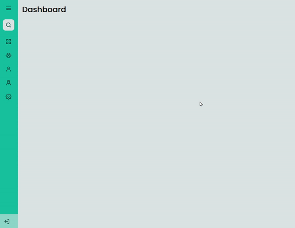

# Sidebar

## 💻 Sobre o desafio

Neste desafio foi proposto criar uma página com uma sidebar como na imagem acima. Quando o usuário clicar no ícone do menu isso deve fazer com que o estado da sidebar mude entre "aberto", mostrando ícones e texto e "fechado", mostrando apenas os ícones, de acordo com o **[layout do projeto](https://www.figma.com/community/file/1241118391775012454/sidebar-desafio-discover) disponível no figma**. O desafio está dividido em três partes, estruturação do HTML com o conteúdo, estilização da página com o CSS e interatividade com JavaScript. Além disso foi adicionado **responsividade**.

## 👁️ Live Preview

[🔗 Clique aqui para acessar](https://leanddo.github.io/SideBar-Discover/)

## 📚 Tecnologias

- HTML
- CSS
- Git e Github
- Figma

Feito por Leandro Amaral 🐶